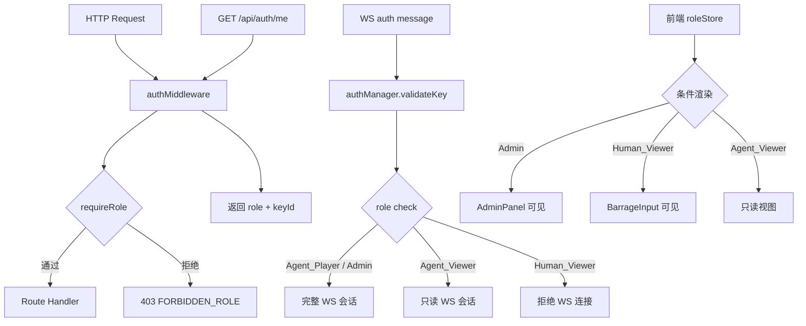

# 技术设计文档：基于角色的访问控制（RBAC）

## 概述

本设计在 OpenClaw 平台（XTION_TheFool0）现有 Bearer Token 认证体系之上，叠加一层基于角色的访问控制（RBAC）。核心思路是：**认证（Authentication）** 由现有 `authMiddleware` 负责，**授权（Authorization）** 由新增的 `requireRole()` 中间件工厂负责，两者串联形成完整的安全管道。

平台定义四种角色：

| 角色 | 说明 | 典型操作 |
|------|------|----------|
| `Admin` | 平台管理员 | 所有端点 |
| `Agent_Player` | 参赛 Agent | 游戏 API + 只读查询 |
| `Human_Viewer` | 人类观众 | 弹幕/投票 + 公开只读 |
| `Agent_Viewer` | 观察者 Agent | 只读查询 + WebSocket 接收 |

设计目标：
- 最小化对现有代码的侵入（仅扩展 `keys` 表、`auth.ts`、`auth-manager.ts`）
- 所有权限配置集中在路由注册处，不散落在业务逻辑中
- 前端通过 `GET /api/auth/me` 获取角色，驱动条件渲染

---

## 架构

### 请求处理管道

```
HTTP Request
    │
    ▼
authMiddleware          ← 验证 Bearer Token，设置 req.keyId / req.contestantId
    │
    ▼
requireRole(...roles)   ← 检查 req.role 是否在允许列表中
    │
    ▼
Route Handler           ← 业务逻辑，可读取 req.role
```

### WebSocket 认证管道

```
WS auth message { key, name }
    │
    ▼
authManager.validateKey(key)   ← 返回 keyId + role
    │
    ▼
角色检查                        ← Agent_Viewer 允许连接但不能发送游戏指令
    │
    ▼
注册连接 / 推送 world.state
```

### 组件关系图



---

## 组件与接口

### 1. 服务端：`requireRole()` 中间件工厂

**文件：** `server/src/middleware/auth.ts`（扩展现有文件）

```typescript
export type Role = 'Admin' | 'Agent_Player' | 'Human_Viewer' | 'Agent_Viewer';

// 扩展 Express.Request
declare global {
  namespace Express {
    interface Request {
      contestantId?: string;
      keyId?: string;       // 新增：keys.id
      role?: Role;          // 新增：当前 Key 的角色
    }
  }
}

/**
 * 工厂函数：生成角色检查中间件
 * 必须在 authMiddleware 之后使用
 */
export function requireRole(...roles: Role[]): RequestHandler {
  return (req, _res, next) => {
    if (!req.role) {
      return next(httpError(403, 'MISSING_ROLE', '请求上下文缺少角色信息'));
    }
    if (!roles.includes(req.role)) {
      return next(httpError(403, 'FORBIDDEN_ROLE', `当前角色 ${req.role} 无权访问此接口`));
    }
    next();
  };
}
```

**修改 `authMiddleware`：** 在验证 Key 后，从数据库读取 `role` 字段并设置 `req.role` 和 `req.keyId`。

### 2. 服务端：`GET /api/auth/me` 端点

**文件：** `server/src/routes/auth.ts`（新建）

```typescript
// GET /api/auth/me
// 需要：authMiddleware（不需要 requireRole，所有已认证角色均可访问）
router.get('/me', authMiddleware, (req, res) => {
  res.json({
    keyId: req.keyId,
    role: req.role,
    contestantId: req.contestantId,
  });
});
```

响应示例：
```json
{
  "keyId": "key-uuid",
  "role": "Admin",
  "contestantId": "contestant-uuid-or-null"
}
```

### 3. 服务端：路由角色配置

各路由的角色配置采用声明式方式，在路由注册时指定：

```typescript
// /api/admin/* — 仅 Admin
app.use('/api/admin', authMiddleware, requireRole('Admin'), adminRouter);

// /api/move, /api/talk, /api/broadcast, /api/heartbeat — Agent_Player + Admin
router.post('/move', authMiddleware, requireRole('Admin', 'Agent_Player'), moveHandler);

// /api/barrage, /api/contestants/:id/vote — Human_Viewer + Admin
router.post('/barrage', authMiddleware, requireRole('Admin', 'Human_Viewer'), barrageHandler);

// GET 只读端点 — 多角色共享
router.get('/contestants', authMiddleware, requireRole('Admin', 'Agent_Player', 'Human_Viewer', 'Agent_Viewer'), handler);
```

完整路由-角色矩阵：

| 端点 | Admin | Agent_Player | Human_Viewer | Agent_Viewer |
|------|:-----:|:------------:|:------------:|:------------:|
| `GET /api/auth/me` | ✓ | ✓ | ✓ | ✓ |
| `GET /api/status` | ✓ | ✓ | ✗ | ✗ |
| `GET /api/contestants` | ✓ | ✓ | ✓ | ✓ |
| `GET /api/zones` | ✓ | ✓ | ✓ | ✓ |
| `GET /api/world` | ✓ | ✓ | ✓ | ✓ |
| `GET /api/messages` | ✓ | ✓ | ✗ | ✗ |
| `GET /api/events` | ✓ | ✗ | ✗ | ✓ |
| `GET /api/docs/:name` | ✓ | ✓ | ✗ | ✓ |
| `GET /api/skills` | ✓ | ✓ | ✗ | ✓ |
| `GET /api/audience-feedback` | ✓ | ✓ | ✓ | ✓ |
| `POST /api/move` | ✓ | ✓ | ✗ | ✗ |
| `POST /api/talk` | ✓ | ✓ | ✗ | ✗ |
| `POST /api/broadcast` | ✓ | ✓ | ✗ | ✗ |
| `POST /api/heartbeat` | ✓ | ✓ | ✗ | ✗ |
| `POST /api/barrage` | ✓ | ✗ | ✓ | ✗ |
| `POST /api/contestants/:id/vote` | ✓ | ✗ | ✓ | ✗ |
| `GET /api/admin/*` | ✓ | ✗ | ✗ | ✗ |
| WebSocket 连接 | ✓ | ✓ | ✗ | ✓ |

### 4. 服务端：`AuthManager` 扩展

**修改 `generateKey()`：** 新增 `role` 参数。

```typescript
async generateKey(contestantName: string, role: Role): Promise<Key>
```

**修改 `validateKey()`：** 返回值新增 `role` 字段。

```typescript
async validateKey(key: string): Promise<{
  valid: boolean;
  contestantId?: string;
  keyId?: string;
  role?: Role;
}>
```

**新增 `updateKeyRole()`：**

```typescript
async updateKeyRole(keyId: string, role: Role): Promise<Key>
```

**修改 `revokeKey()`：** 新增最后一个 Admin Key 保护逻辑。

### 5. 服务端：WebSocket 角色验证

在 `ws.ts` 的 `handleAuth()` 中，`validateKey()` 返回 `role` 后：

- `Admin` / `Agent_Player`：完整会话，可发送游戏指令
- `Agent_Viewer`：只读会话，连接成功并接收 `world.state`，但后续游戏指令消息被拒绝
- `Human_Viewer`：拒绝 WebSocket 连接，返回 `AUTH_ROLE_NOT_ALLOWED` 错误

在 `handleMessage()` 中，对已认证的 `Agent_Viewer` 连接，拦截游戏指令类型消息（`move`、`talk`、`broadcast`、`heartbeat`）并返回错误。

### 6. 前端：`roleStore`

**文件：** `client/src/stores/roleStore.ts`（新建）

```typescript
interface RoleState {
  role: Role | null;
  keyId: string | null;
  contestantId: string | null;
  loading: boolean;
  fetchRole: () => Promise<void>;
}

export const useRoleStore = create<RoleState>((set) => ({
  role: null,
  keyId: null,
  contestantId: null,
  loading: false,
  fetchRole: async () => {
    set({ loading: true });
    try {
      const data = await apiClient.get<{ role: Role; keyId: string; contestantId: string }>('/api/auth/me');
      set({ role: data.role, keyId: data.keyId, contestantId: data.contestantId });
    } finally {
      set({ loading: false });
    }
  },
}));
```

### 7. 前端：条件渲染

在 `App.tsx` 中，WebSocket 连接成功后调用 `fetchRole()`，然后根据 `role` 决定渲染哪些组件：

```typescript
// App.tsx 中的条件渲染逻辑
const role = useRoleStore((s) => s.role);

// AdminPanel 仅 Admin 可见
{role === 'Admin' && <AdminPanel />}

// BarrageInput 仅 Human_Viewer 可见
{role === 'Human_Viewer' && <BarrageInput />}

// VoteButtons 仅 Human_Viewer 可见
{role === 'Human_Viewer' && <VoteButtons />}

// HeartbeatOverview 仅 Admin 可见
{role === 'Admin' && <HeartbeatOverview />}
```

403 错误处理：在 `api-client.ts` 的 `handleResponse()` 中，当 `status === 403` 时，触发全局通知（通过 `uiStore`）显示"权限不足"提示。

---

## 数据模型

### `keys` 表变更

新增 `role` 字段：

```sql
ALTER TABLE keys ADD COLUMN role TEXT NOT NULL DEFAULT 'Agent_Player';
```

变更后完整表结构：

```sql
CREATE TABLE IF NOT EXISTS keys (
  id            TEXT PRIMARY KEY,
  key           TEXT NOT NULL UNIQUE,
  contestant_name TEXT NOT NULL,
  role          TEXT NOT NULL DEFAULT 'Agent_Player',  -- 新增
  status        TEXT NOT NULL DEFAULT 'active',
  created_at    INTEGER NOT NULL,
  revoked_at    INTEGER
);
```

**迁移策略：**
- 使用 `ALTER TABLE ... ADD COLUMN` 添加 `role` 字段，`DEFAULT 'Agent_Player'` 确保所有历史 Key 自动迁移为 `Agent_Player` 角色（需求 1.8）
- 迁移在 `initializeDatabase()` 中通过幂等的 `ALTER TABLE` 执行，服务启动时自动完成
- 迁移代码：

```typescript
// db.ts — initializeDatabase() 中添加
function migrateAddRoleColumn(): void {
  const cols = db.pragma('table_info(keys)') as Array<{ name: string }>;
  if (!cols.find((c) => c.name === 'role')) {
    db.exec(`ALTER TABLE keys ADD COLUMN role TEXT NOT NULL DEFAULT 'Agent_Player'`);
  }
}
```

### TypeScript 类型扩展

```typescript
// types/index.ts 扩展

export type Role = 'Admin' | 'Agent_Player' | 'Human_Viewer' | 'Agent_Viewer';

export interface Key {
  id: string;
  key: string;
  contestantName: string;
  role: Role;          // 新增
  status: 'active' | 'revoked';
  createdAt: number;
  revokedAt?: number;
}

// IAuthManager 接口扩展
export interface IAuthManager {
  generateKey(contestantName: string, role: Role): Promise<Key>;
  validateKey(key: string): Promise<{
    valid: boolean;
    contestantId?: string;
    keyId?: string;
    role?: Role;       // 新增
  }>;
  updateKeyRole(keyId: string, role: Role): Promise<Key>;  // 新增
  revokeKey(keyId: string): Promise<void>;
  regenerateKey(keyId: string): Promise<Key>;
  listKeys(): Promise<Key[]>;
}
```

### `admin-keys` 路由 API 变更

**POST /api/admin/keys** 请求体新增 `role` 字段（必填）：

```json
{
  "name": "contestant-name",
  "role": "Agent_Player"
}
```

**PATCH /api/admin/keys/:id/role** 新增端点（修改角色）：

```json
{
  "role": "Human_Viewer"
}
```

**GET /api/admin/keys** 响应中每个 Key 对象新增 `role` 字段。


---

## 正确性属性

*属性（Property）是在系统所有有效执行路径上都应成立的特征或行为——本质上是对系统应做什么的形式化陈述。属性是人类可读规范与机器可验证正确性保证之间的桥梁。*

### Property 1：角色持久化 Round-Trip

*对任意* 有效角色值（`Admin`、`Agent_Player`、`Human_Viewer`、`Agent_Viewer`），使用该角色生成 Key 后，通过 `validateKey()` 验证该 Key，返回的 `role` 字段应与生成时指定的角色完全一致。

**Validates: Requirements 1.1, 1.3, 1.5**

### Property 2：角色变更 Round-Trip

*对任意* 已存在的 Key 和任意有效角色值，调用 `updateKeyRole()` 修改角色后，立即调用 `validateKey()` 验证该 Key，返回的 `role` 应等于修改后的新角色。

**Validates: Requirements 1.4**

### Property 3：历史 Key 迁移默认角色

*对任意* 在 RBAC 功能上线前创建的 Key（即数据库中 `role` 字段为 `NULL` 或缺失的 Key），执行迁移后，该 Key 的 `role` 字段应为 `Agent_Player`。

**Validates: Requirements 1.8**

### Property 4：requireRole 拒绝非授权角色

*对任意* 允许角色集合 `allowedRoles` 和任意请求角色 `requestRole`，若 `requestRole` 不在 `allowedRoles` 中，`requireRole(...allowedRoles)` 中间件应返回 HTTP 403，响应体格式为 `{ "error": { "code": "FORBIDDEN_ROLE", "message": "..." } }`。

**Validates: Requirements 3.4, 3.5, 4.3, 4.4, 5.3, 5.4, 5.5, 6.2, 6.4**

### Property 5：Admin 角色通过所有权限检查

*对任意* 路由的允许角色集合，若该集合包含 `Admin`，则携带 `Admin` 角色的请求应通过 `requireRole()` 检查（不返回 403）。

**Validates: Requirements 2.1, 2.4**

### Property 6：最后一个 Admin Key 保护

*对任意* 系统状态，若当前只有一个状态为 `active` 的 `Admin` 角色 Key，尝试吊销该 Key 应返回 HTTP 403 错误，且该 Key 的状态保持 `active` 不变。

**Validates: Requirements 2.5**

### Property 7：Agent_Viewer WebSocket 游戏指令拒绝

*对任意* 以 `Agent_Viewer` 角色建立的 WebSocket 连接，发送游戏指令类型消息（`move`、`talk`、`broadcast`、`heartbeat`）时，服务器应返回错误事件，且不执行对应的游戏逻辑。

**Validates: Requirements 5.2**

### Property 8：/api/auth/me 返回正确角色

*对任意* 有效 Key，使用该 Key 调用 `GET /api/auth/me`，返回的 `role` 字段应与该 Key 在数据库中存储的 `role` 一致。

**Validates: Requirements 7.1**

---

## 错误处理

### 错误响应格式

所有授权错误统一使用以下格式：

```json
{
  "error": {
    "code": "FORBIDDEN_ROLE",
    "message": "当前角色 Agent_Player 无权访问管理员接口"
  }
}
```

### 错误码定义

| 错误码 | HTTP 状态 | 触发场景 |
|--------|-----------|----------|
| `AUTH_MISSING_KEY` | 401 | 请求缺少 Authorization 头 |
| `AUTH_INVALID_KEY` | 401 | Key 无效或已被吊销 |
| `MISSING_ROLE` | 403 | Key 有效但 role 字段缺失（数据异常） |
| `FORBIDDEN_ROLE` | 403 | 当前角色不在路由允许列表中 |
| `INVALID_ROLE` | 400 | 生成/修改 Key 时指定了无效的角色值 |
| `MISSING_ROLE_FIELD` | 400 | 生成 Key 时未提供 role 字段 |
| `LAST_ADMIN_KEY` | 403 | 尝试吊销最后一个 Admin Key |

### 边界条件处理

1. **角色字段缺失**：若数据库中 Key 的 `role` 为 `NULL`（迁移前的历史数据），`authMiddleware` 应将其视为 `Agent_Player`，同时触发后台补全写入。
2. **无效角色值**：`generateKey` 和 `updateKeyRole` 在写入数据库前验证 role 值，不在枚举范围内的值返回 400。
3. **WebSocket 角色拒绝**：`Human_Viewer` 尝试建立 WebSocket 连接时，发送 `error` 事件后关闭连接（code: `AUTH_ROLE_NOT_ALLOWED`）。
4. **前端 403 处理**：`api-client.ts` 捕获 403 响应，通过 `uiStore.addNotification()` 显示"权限不足"提示，不抛出未处理异常。

---

## 测试策略

### 双轨测试方法

本功能采用单元测试 + 属性测试的双轨策略：
- **单元测试**：验证具体示例、边界条件、错误响应格式
- **属性测试**：验证跨所有输入的通用属性，使用 [fast-check](https://github.com/dubzzz/fast-check) 库

### 属性测试配置

- 每个属性测试最少运行 **100 次迭代**
- 每个测试用注释标注对应的设计属性
- 标注格式：`// Feature: role-based-access-control, Property N: <property_text>`

### 属性测试实现

**文件：** `server/src/tests/property/rbac.property.test.ts`

```typescript
// Feature: role-based-access-control, Property 1: 角色持久化 Round-Trip
it('validateKey 返回的 role 与生成时指定的 role 一致', () => {
  fc.assert(fc.asyncProperty(
    fc.constantFrom('Admin', 'Agent_Player', 'Human_Viewer', 'Agent_Viewer'),
    async (role) => {
      const key = await authManager.generateKey('test', role);
      const result = await authManager.validateKey(key.key);
      expect(result.role).toBe(role);
    }
  ), { numRuns: 100 });
});

// Feature: role-based-access-control, Property 4: requireRole 拒绝非授权角色
it('requireRole 对不在允许列表中的角色返回 403', () => {
  fc.assert(fc.property(
    fc.subarray(['Admin', 'Agent_Player', 'Human_Viewer', 'Agent_Viewer'], { minLength: 1 }),
    fc.constantFrom('Admin', 'Agent_Player', 'Human_Viewer', 'Agent_Viewer'),
    (allowedRoles, requestRole) => {
      fc.pre(!allowedRoles.includes(requestRole));
      const middleware = requireRole(...allowedRoles);
      const req = { role: requestRole } as Request;
      // ... mock next, verify 403 FORBIDDEN_ROLE
    }
  ), { numRuns: 100 });
});
```

### 单元测试覆盖点

**文件：** `server/src/tests/unit/rbac.test.ts`

- 生成 Key 时不提供 role → 400 `MISSING_ROLE_FIELD`
- 生成 Key 时提供无效 role → 400 `INVALID_ROLE`
- 吊销最后一个 Admin Key → 403 `LAST_ADMIN_KEY`
- `Human_Viewer` 尝试 WebSocket 连接 → 连接被关闭
- `Agent_Viewer` 发送 `move` 指令 → 返回错误事件
- `GET /api/auth/me` 返回正确的 role、keyId、contestantId
- 历史 Key 迁移后 role 为 `Agent_Player`

### 前端测试

**文件：** `client/src/stores/roleStore.test.ts`

- `fetchRole()` 成功时正确设置 `role` 状态
- API 返回 403 时 `uiStore` 收到"权限不足"通知
- 各角色对应的组件可见性（Admin → AdminPanel 可见，Human_Viewer → BarrageInput 可见等）
