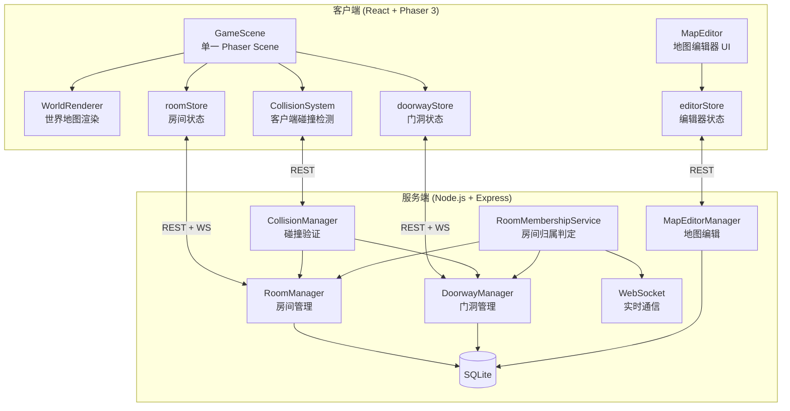
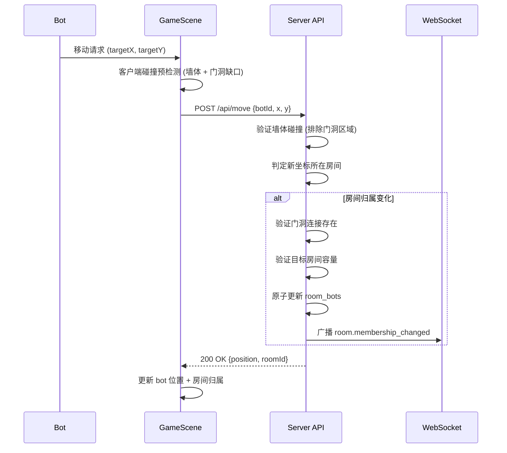

# 设计文档：房间-墙体-门洞系统

## 概述

本系统在现有的 Phaser 3 游戏引擎和 Node.js 后端基础上，构建一个连续的物理世界地图。所有房间、墙体、门洞共存于同一个 Phaser Scene 的坐标空间中。bot 通过连续坐标移动在房间之间穿行，门洞是墙体上的物理缺口（无碰撞体），房间归属由 bot 坐标落在哪个房间的 bounds 内来判定。

核心设计决策：
- **单一 Scene 架构**：复用现有 `GameScene`，所有房间内容在同一个场景中渲染，无需场景切换
- **门洞 = 墙体缺口**：门洞不是独立的碰撞体，而是墙体上"不存在碰撞体"的区域，bot 自然通过
- **坐标驱动的房间归属**：服务端和客户端都通过 AABB 包含检测判定 bot 所在房间，无需显式的"进入/离开"操作
- **增量扩展**：在现有 `RoomManager`、`CollisionManager`、`MapEditorManager` 基础上扩展，不重写

## 架构

### 系统架构图



### 数据流



## 组件与接口

### 1. DoorwayManager（新增 — 服务端）

门洞数据的 CRUD 管理和验证逻辑。

```typescript
// server/src/modules/doorway-manager.ts

interface Doorway {
  id: string;
  roomAId: string;
  roomBId: string;
  x: number;
  y: number;
  width: number;
  height: number;
  createdAt: string;
}

interface DoorwayConfig {
  roomAId: string;
  roomBId: string;
  x: number;
  y: number;
  width: number;
  height: number;
}

class DoorwayManager {
  createDoorway(config: DoorwayConfig): Doorway;
  deleteDoorway(doorwayId: string): void;
  updateDoorway(doorwayId: string, updates: Partial<DoorwayConfig>): Doorway;
  getDoorway(doorwayId: string): Doorway;
  getDoorwaysByRoom(roomId: string): Doorway[];
  getDoorwayBetweenRooms(roomAId: string, roomBId: string): Doorway[];
  getAllDoorways(): Doorway[];
  validateDoorwayPlacement(config: DoorwayConfig): ValidationResult;
}
```

**验证逻辑**：
- 门洞位置必须在两个房间的共享边界上
- 门洞宽度不能小于 bot 碰撞箱宽度（32px）
- 两个房间必须相邻（共享一条边界线）

### 2. RoomMembershipService（新增 — 服务端）

基于坐标的房间归属判定服务。

```typescript
// server/src/modules/room-membership-service.ts

interface MembershipChange {
  botId: string;
  previousRoomId: string | null;
  newRoomId: string | null;
}

class RoomMembershipService {
  /** 根据坐标判定所在房间 */
  getRoomAtPosition(x: number, y: number): Room | null;
  
  /** 处理 bot 移动后的房间归属更新 */
  updateMembership(botId: string, newX: number, newY: number): MembershipChange | null;
  
  /** 验证两个房间之间是否有门洞连接 */
  hasConnection(roomAId: string, roomBId: string): boolean;
  
  /** 验证房间边界不重叠 */
  validateNoOverlap(bounds: {x1:number,y1:number,x2:number,y2:number}, excludeRoomId?: string): boolean;
}
```

### 3. CollisionManager 扩展（修改现有）

在现有碰撞检测中排除门洞区域。

```typescript
// 扩展 server/src/modules/collision-manager.ts

class CollisionManager {
  // 现有方法保持不变
  
  /** 新增：检查墙体碰撞时排除门洞区域 */
  checkWallCollisionWithDoorways(
    roomId: string,
    targetPos: Position,
    doorways: Doorway[]
  ): boolean;
  
  /** 新增：跨房间移动验证 */
  validateCrossRoomMovement(
    botId: string,
    fromRoomId: string,
    toRoomId: string,
    targetPos: Position
  ): ValidationResult;
}
```

### 4. 客户端 CollisionSystem 扩展（修改现有）

```typescript
// 扩展 client/src/game/collision-system.ts

class CollisionSystem {
  // 现有方法保持不变
  
  /** 新增：墙体碰撞检测时排除门洞区域 */
  checkWallCollisionWithDoorways(
    position: { x: number; y: number },
    walls: Wall[],
    doorways: Doorway[]
  ): CollisionResult;
}
```

### 5. WorldRenderer（新增 — 客户端）

负责在 GameScene 中渲染所有房间、墙体、门洞的可视化。

```typescript
// client/src/game/world-renderer.ts

class WorldRenderer {
  constructor(scene: Phaser.Scene);
  
  /** 渲染所有房间区域 */
  renderRooms(rooms: Room[]): void;
  
  /** 渲染墙体，在门洞位置留出缺口 */
  renderWalls(walls: Wall[], doorways: Doorway[]): void;
  
  /** 渲染门洞标记（虚线/高亮） */
  renderDoorways(doorways: Doorway[]): void;
  
  /** 更新单个房间的渲染 */
  updateRoom(room: Room): void;
  
  /** 清理所有渲染对象 */
  destroy(): void;
}
```

### 6. doorwayStore（新增 — 客户端 Zustand Store）

```typescript
// client/src/stores/doorwayStore.ts

interface DoorwayState {
  doorways: Record<string, Doorway>;
  setDoorways(doorways: Doorway[]): void;
  addDoorway(doorway: Doorway): void;
  removeDoorway(doorwayId: string): void;
  getDoorwaysByRoom(roomId: string): Doorway[];
}
```

### 7. editorStore 扩展（修改现有）

在现有编辑器 store 中增加门洞管理工具。

```typescript
// 扩展 client/src/stores/editorStore.ts

interface EditorState {
  // 现有字段保持不变
  selectedTool: 'select' | 'wall' | 'spawn' | 'boundary' | 'doorway'; // 新增 doorway
  doorways: Doorway[];
  
  addDoorway(doorway: Doorway): void;
  removeDoorway(doorwayId: string): void;
  updateDoorway(doorwayId: string, updates: Partial<Doorway>): void;
}
```

### 8. API 路由

```typescript
// server/src/routes/doorways.ts

// POST   /api/doorways              — 创建门洞
// GET    /api/doorways              — 获取所有门洞
// GET    /api/doorways/:id          — 获取门洞详情
// PUT    /api/doorways/:id          — 更新门洞
// DELETE /api/doorways/:id          — 删除门洞
// GET    /api/rooms/:id/doorways    — 获取房间的所有门洞
```

### 9. WebSocket 事件扩展

```typescript
// 新增 WebSocket 事件类型

// 服务端 → 客户端
'room.membership_changed': {
  botId: string;
  previousRoomId: string | null;
  newRoomId: string | null;
  position: { x: number; y: number };
}

'doorway.created': { doorway: Doorway }
'doorway.deleted': { doorwayId: string }
```

## 数据模型

### 数据库表

#### doorways 表（新增）

| 字段 | 类型 | 约束 | 说明 |
|------|------|------|------|
| id | TEXT | PRIMARY KEY | 门洞唯一标识 |
| room_a_id | TEXT | NOT NULL, FK → rooms(id) | 关联房间 A |
| room_b_id | TEXT | NOT NULL, FK → rooms(id) | 关联房间 B |
| x | REAL | NOT NULL | 门洞中心 X 坐标 |
| y | REAL | NOT NULL | 门洞中心 Y 坐标 |
| width | REAL | NOT NULL | 门洞开口宽度 |
| height | REAL | NOT NULL | 门洞开口高度 |
| created_at | TIMESTAMP | | 创建时间 |

```sql
CREATE TABLE IF NOT EXISTS doorways (
  id TEXT PRIMARY KEY,
  room_a_id TEXT NOT NULL,
  room_b_id TEXT NOT NULL,
  x REAL NOT NULL,
  y REAL NOT NULL,
  width REAL NOT NULL,
  height REAL NOT NULL,
  created_at TIMESTAMP,
  FOREIGN KEY (room_a_id) REFERENCES rooms(id) ON DELETE CASCADE,
  FOREIGN KEY (room_b_id) REFERENCES rooms(id) ON DELETE CASCADE
);
```

#### 现有表无需修改

- `rooms` 表：已有 `bounds_x1`, `bounds_y1`, `bounds_x2`, `bounds_y2` 字段
- `walls` 表：已有完整的墙体数据结构
- `room_bots` 表：已有 `room_id`, `bot_id`, `position_x`, `position_y` 字段

### TypeScript 类型定义

```typescript
// 新增到 server/src/types/index.ts

interface Doorway {
  id: string;
  roomAId: string;
  roomBId: string;
  x: number;
  y: number;
  width: number;
  height: number;
  createdAt: string;
}
```

### 房间归属判定算法

```typescript
/**
 * 判定坐标 (x, y) 所在的房间
 * 使用 AABB 包含检测：bounds_x1 <= x <= bounds_x2 && bounds_y1 <= y <= bounds_y2
 */
function getRoomAtPosition(x: number, y: number, rooms: Room[]): Room | null {
  for (const room of rooms) {
    if (!room.bounds) continue;
    const { x1, y1, x2, y2 } = room.bounds;
    if (x >= x1 && x <= x2 && y >= y1 && y <= y2) {
      return room;
    }
  }
  return null;
}
```

### 门洞碰撞排除算法

```typescript
/**
 * 检查位置是否与墙体碰撞，但排除门洞覆盖的区域
 * 如果 bot 的碰撞箱与墙体重叠，但该重叠区域完全在某个门洞范围内，则不算碰撞
 */
function isPositionInDoorway(
  x: number, y: number, 
  doorways: Doorway[]
): boolean {
  for (const dw of doorways) {
    const halfW = dw.width / 2;
    const halfH = dw.height / 2;
    if (x >= dw.x - halfW && x <= dw.x + halfW &&
        y >= dw.y - halfH && y <= dw.y + halfH) {
      return true;
    }
  }
  return false;
}
```

### 房间重叠检测算法

```typescript
/**
 * 检查两个矩形区域是否重叠
 * 用于验证房间边界不互相重叠
 */
function boundsOverlap(
  a: { x1: number; y1: number; x2: number; y2: number },
  b: { x1: number; y1: number; x2: number; y2: number }
): boolean {
  return a.x1 < b.x2 && a.x2 > b.x1 && a.y1 < b.y2 && a.y2 > b.y1;
}
```


## 正确性属性

*属性（Property）是在系统所有合法执行中都应成立的特征或行为——本质上是对系统应做什么的形式化陈述。属性是人类可读规格说明与机器可验证正确性保证之间的桥梁。*

基于需求文档中的验收标准，经过可测试性分析和冗余消除，提炼出以下正确性属性：

### Property 1: 门洞数据持久化往返

*对于任意*合法的门洞配置（包含 roomAId、roomBId、x、y、width、height），创建门洞后再读取，应得到与原始配置等价的门洞数据。

**Validates: Requirements 3.1, 7.3, 7.4**

### Property 2: 房间边界重叠检测

*对于任意*两个矩形区域 A 和 B，当且仅当 A.x1 < B.x2 且 A.x2 > B.x1 且 A.y1 < B.y2 且 A.y2 > B.y1 时，重叠检测函数应返回 true。不重叠的矩形对应返回 false。

**Validates: Requirements 1.4, 9.7**

### Property 3: 墙体碰撞与门洞排除

*对于任意* bot 位置、墙体列表和门洞列表：如果 bot 碰撞箱与某墙体重叠，且该位置不在任何门洞范围内，则碰撞检测应返回碰撞；如果该位置在某个门洞范围内，则碰撞检测应返回无碰撞（即门洞区域允许通过）。

**Validates: Requirements 2.2, 3.2, 5.2, 5.4, 8.1, 8.3**

### Property 4: 门洞必须位于共享边界

*对于任意*门洞配置和两个房间，门洞验证函数应仅在门洞位置处于两个房间的共享边界线上时返回有效。不在共享边界上的门洞配置应被拒绝。

**Validates: Requirements 3.3**

### Property 5: 基于坐标的房间归属判定

*对于任意*坐标 (x, y) 和一组不重叠的房间，房间归属函数应返回唯一包含该坐标的房间（如果存在），或返回 null（如果坐标不在任何房间内）。当坐标从房间 A 的范围移动到房间 B 的范围时，归属应从 A 变为 B。

**Validates: Requirements 4.1, 4.2, 4.3, 5.3**

### Property 6: 跨房间移动需要门洞连接

*对于任意*两个不同的房间 A 和 B，如果 bot 的坐标从房间 A 的范围移动到房间 B 的范围，服务端验证应仅在 A 和 B 之间存在门洞连接时允许该移动。无门洞连接时应拒绝。

**Validates: Requirements 8.2**

### Property 7: 房间容量限制

*对于任意*已达到容量上限的房间，尝试将新 bot 移入该房间应被拒绝，且房间内的 bot 数量不应超过容量值。

**Validates: Requirements 8.5**

### Property 8: 房间归属更新原子性

*对于任意* bot 的跨房间移动，更新完成后，bot 应恰好属于一个房间（新房间），且不再属于旧房间。数据库中 room_bots 表应反映这一变更。

**Validates: Requirements 8.4**

## 错误处理

### 服务端错误处理

| 场景 | HTTP 状态码 | 错误码 | 处理方式 |
|------|------------|--------|---------|
| 门洞关联的房间不存在 | 404 | ROOM_NOT_FOUND | 返回错误，不创建门洞 |
| 门洞不在共享边界上 | 400 | INVALID_DOORWAY_PLACEMENT | 返回验证错误详情 |
| 门洞宽度小于 bot 碰撞箱 | 400 | DOORWAY_TOO_NARROW | 返回警告 |
| 房间边界重叠 | 400 | ROOM_OVERLAP | 返回重叠的房间 ID |
| bot 移动到墙体内 | 400 | WALL_COLLISION | 拒绝移动，返回碰撞信息 |
| 跨房间移动无门洞连接 | 400 | NO_DOORWAY_CONNECTION | 拒绝移动 |
| 目标房间已满 | 400 | ROOM_AT_CAPACITY | 拒绝移动，返回容量信息 |
| bot 坐标不在任何房间内 | 200 | — | 正常处理，标记为"房间外" |
| 数据库事务失败 | 500 | INTERNAL_ERROR | 回滚事务，返回错误 |

### 客户端错误处理

- **碰撞预检测失败**：客户端在发送移动请求前进行本地碰撞检测，如果检测到碰撞则不发送请求，减少无效网络请求
- **服务端拒绝移动**：客户端回滚 bot 位置到移动前的坐标
- **WebSocket 断连**：使用现有的重连机制，重连后重新同步房间归属状态
- **门洞数据不一致**：客户端定期从服务端同步门洞数据，以服务端为准

## 测试策略

### 双重测试方法

本系统采用单元测试和属性测试相结合的方式：

- **单元测试**：验证具体示例、边界情况和错误条件
- **属性测试**：验证在所有输入上都成立的通用属性

两者互补：单元测试捕获具体 bug，属性测试验证通用正确性。

### 属性测试配置

- **测试库**：使用 `fast-check` (TypeScript 属性测试库)
- **每个属性测试最少运行 100 次迭代**
- **每个属性测试必须用注释引用设计文档中的属性编号**
- **标签格式**：`Feature: room-door-portal-system, Property {number}: {property_text}`
- **每个正确性属性由一个属性测试实现**

### 单元测试范围

单元测试聚焦于：
- 门洞 CRUD 操作的具体示例
- 门洞宽度小于 bot 碰撞箱的边界情况（需求 3.5）
- bot 坐标恰好在房间边界线上的边界情况（需求 4.4）
- API 路由的参数验证和错误响应
- WebSocket 事件的正确格式

### 属性测试范围

每个正确性属性对应一个属性测试：

1. **Property 1 测试**：生成随机门洞配置 → 创建 → 读取 → 验证等价
2. **Property 2 测试**：生成随机矩形对 → 计算预期重叠结果 → 验证检测函数
3. **Property 3 测试**：生成随机墙体+门洞+bot位置 → 验证碰撞检测结果
4. **Property 4 测试**：生成随机房间对+门洞位置 → 验证共享边界验证
5. **Property 5 测试**：生成随机不重叠房间+坐标 → 验证归属判定
6. **Property 6 测试**：生成随机房间对（有/无门洞）→ 验证跨房间移动验证
7. **Property 7 测试**：生成随机房间容量+bot数量 → 验证容量限制
8. **Property 8 测试**：生成随机跨房间移动 → 验证更新后的数据库状态

### 集成测试

- 完整的 bot 移动流程：从房间 A 通过门洞移动到房间 B
- 地图编辑器：创建房间 → 放置墙体 → 定义门洞 → 保存 → 重新加载
- WebSocket 通知：房间归属变化时的实时通知
