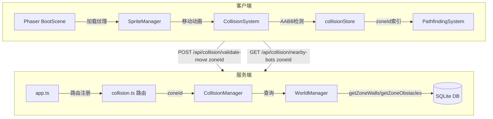

# 技术设计文档：Zone 障碍物系统

## 概览

本次重构将现有的多房间（Room）系统简化为单一大 Zone 系统。核心目标是：

- 删除 Room、Doorway、RoomMembership、MapEditor 等概念及其全部代码
- 在 Zone 内支持 Wall（墙体）和 Obstacle（障碍物）作为碰撞体
- 将碰撞检测、寻路系统、客户端状态管理全部从 roomId 维度迁移到 zoneId 维度
- 障碍物配置通过服务端 `db.ts` 的 seed 函数硬编码写入，不提供管理员 UI

重构后，所有玩家（Bot/Contestant）在同一个大 Zone（`zone-main-hall`，1000×800）中活动，碰撞体由 `walls` 表和 `obstacles` 表管理。

---

## 架构

### 高层架构图



### 删除的模块

| 模块 | 路径 | 原因 |
|------|------|------|
| room-manager | server/src/modules/room-manager.ts | Room 系统移除 |
| room-membership-service | server/src/modules/room-membership-service.ts | Room 系统移除 |
| doorway-manager | server/src/modules/doorway-manager.ts | Doorway 系统移除 |
| map-editor-manager | server/src/modules/map-editor-manager.ts | 编辑器移除 |
| rooms 路由 | server/src/routes/rooms.ts | Room API 移除 |
| doorways 路由 | server/src/routes/doorways.ts | Doorway API 移除 |
| map-editor 路由 | server/src/routes/map-editor.ts | 编辑器 API 移除 |
| roomStore | client/src/stores/roomStore.ts | 客户端 Room 状态移除 |
| doorwayStore | client/src/stores/doorwayStore.ts | 客户端 Doorway 状态移除 |
| editorStore | client/src/stores/editorStore.ts | 编辑器状态移除 |
| MapEditor | client/src/components/MapEditor.tsx | 编辑器组件移除 |
| RoomManagementPanel | client/src/components/RoomManagementPanel.tsx | Room 管理组件移除 |
| RoomList | client/src/components/RoomList.tsx | Room 列表组件移除 |
| RoomGraphBuilder | client/src/game/pathfinding/room-graph-builder.ts | 多房间寻路移除 |


---

## 数据库 Schema 变更

### 删除的表

- `rooms` — Room 系统核心表
- `room_bots` — Bot 与 Room 的关联表
- `doorways` — 门洞表
- `room_configs` — Room 配置表

### 修改的表

#### `walls` 表

```sql
-- 旧结构
CREATE TABLE walls (
  id TEXT PRIMARY KEY,
  room_id TEXT NOT NULL,           -- 删除
  ...
  FOREIGN KEY (room_id) REFERENCES rooms(id) ON DELETE CASCADE  -- 删除
);

-- 新结构
CREATE TABLE walls (
  id TEXT PRIMARY KEY,
  zone_id TEXT NOT NULL,           -- 新增，替换 room_id
  x REAL NOT NULL,
  y REAL NOT NULL,
  width REAL NOT NULL,
  height REAL NOT NULL,
  rotation REAL DEFAULT 0,
  created_at TIMESTAMP,
  FOREIGN KEY (zone_id) REFERENCES zones(id) ON DELETE CASCADE
);
```

#### `spawn_points` 表

```sql
-- room_id 替换为 zone_id
CREATE TABLE spawn_points (
  id TEXT PRIMARY KEY,
  zone_id TEXT NOT NULL,           -- 替换 room_id
  x REAL NOT NULL,
  y REAL NOT NULL,
  is_available BOOLEAN DEFAULT 1,
  created_at TIMESTAMP,
  FOREIGN KEY (zone_id) REFERENCES zones(id) ON DELETE CASCADE
);
```

### 新增的表

#### `obstacles` 表

```sql
CREATE TABLE obstacles (
  id TEXT PRIMARY KEY,
  zone_id TEXT NOT NULL,
  x REAL NOT NULL,
  y REAL NOT NULL,
  width REAL NOT NULL,
  height REAL NOT NULL,
  rotation REAL DEFAULT 0,
  type TEXT DEFAULT 'generic',     -- 'rock' | 'tree' | 'crate' | 'generic'
  created_at TIMESTAMP,
  FOREIGN KEY (zone_id) REFERENCES zones(id) ON DELETE CASCADE
);
```

#### `zone_configs` 表（替代 `room_configs`）

```sql
CREATE TABLE zone_configs (
  id TEXT PRIMARY KEY,
  zone_id TEXT NOT NULL,
  config_json TEXT NOT NULL,
  version INTEGER NOT NULL,
  created_at TIMESTAMP,
  FOREIGN KEY (zone_id) REFERENCES zones(id) ON DELETE CASCADE
);
```

### 索引变更

```sql
-- 删除旧索引
DROP INDEX IF EXISTS idx_walls_room_id;
DROP INDEX IF EXISTS idx_spawn_points_room_id;
DROP INDEX IF EXISTS idx_room_configs_room_id;
DROP INDEX IF EXISTS idx_room_bots_room_id;
DROP INDEX IF EXISTS idx_room_bots_bot_id;
DROP INDEX IF EXISTS idx_room_configs_room_version;
DROP INDEX IF EXISTS idx_doorways_room_a_id;
DROP INDEX IF EXISTS idx_doorways_room_b_id;

-- 新增索引
CREATE INDEX IF NOT EXISTS idx_walls_zone_id ON walls(zone_id);
CREATE INDEX IF NOT EXISTS idx_spawn_points_zone_id ON spawn_points(zone_id);
CREATE INDEX IF NOT EXISTS idx_obstacles_zone_id ON obstacles(zone_id);
CREATE INDEX IF NOT EXISTS idx_zone_configs_zone_id ON zone_configs(zone_id);
```

---

## 组件与接口

### 服务端类型定义（server/src/types/index.ts）

删除以下接口：`Room`、`RoomConfig`、`RoomBot`、`Doorway`、`DoorwayConfig`、`MembershipChange`、`RoomType`

更新 `Wall` 接口：

```typescript
export interface Wall {
  id: string;
  zoneId: string;      // 替换 roomId
  x: number;
  y: number;
  width: number;
  height: number;
  rotation: number;
  createdAt: string;
}
```

新增 `Obstacle` 接口：

```typescript
export interface Obstacle {
  id: string;
  zoneId: string;
  x: number;
  y: number;
  width: number;
  height: number;
  rotation: number;
  type: 'rock' | 'tree' | 'crate' | 'generic';
  createdAt: string;
}
```

更新 `SpawnPoint` 接口：

```typescript
export interface SpawnPoint {
  id: string;
  zoneId: string;      // 替换 roomId
  x: number;
  y: number;
  isAvailable: boolean;
  createdAt: string;
}
```

更新 `IWorldManager` 接口，新增方法：

```typescript
getZoneWalls(zoneId: string): Wall[];
getZoneObstacles(zoneId: string): Obstacle[];
```


---

## 数据模型

### 障碍物配置（硬编码 Seed 数据）

障碍物不通过管理员 UI 配置，而是在 `server/src/db.ts` 的 `seedObstacles()` 函数中硬编码写入。初始化时调用一次，使用 `INSERT OR IGNORE` 保证幂等性。

```typescript
// server/src/db.ts — seedObstacles 函数示例
const DEFAULT_OBSTACLES = [
  // 左侧石块群
  { id: 'obs-rock-1', zoneId: 'zone-main-hall', x: 150, y: 150, width: 40, height: 40, rotation: 0, type: 'rock' },
  { id: 'obs-rock-2', zoneId: 'zone-main-hall', x: 200, y: 160, width: 30, height: 30, rotation: 0, type: 'rock' },
  // 中央树木
  { id: 'obs-tree-1', zoneId: 'zone-main-hall', x: 480, y: 350, width: 30, height: 30, rotation: 0, type: 'tree' },
  { id: 'obs-tree-2', zoneId: 'zone-main-hall', x: 520, y: 380, width: 30, height: 30, rotation: 0, type: 'tree' },
  // 右侧箱子
  { id: 'obs-crate-1', zoneId: 'zone-main-hall', x: 750, y: 300, width: 40, height: 40, rotation: 0, type: 'crate' },
  { id: 'obs-crate-2', zoneId: 'zone-main-hall', x: 800, y: 300, width: 40, height: 40, rotation: 0, type: 'crate' },
] as const;

function seedObstacles(): void {
  const insert = db.prepare(`
    INSERT OR IGNORE INTO obstacles (id, zone_id, x, y, width, height, rotation, type, created_at)
    VALUES (?, ?, ?, ?, ?, ?, ?, ?, ?)
  `);
  const now = new Date().toISOString();
  const seedAll = db.transaction(() => {
    for (const obs of DEFAULT_OBSTACLES) {
      insert.run(obs.id, obs.zoneId, obs.x, obs.y, obs.width, obs.height, obs.rotation, obs.type, now);
    }
  });
  seedAll();
}
```

同样，`walls` 表的 seed 数据也在 `seedWalls()` 函数中硬编码，替代原来的 `seedDefaultRoom()`。

`initializeDatabase()` 调用顺序：

```typescript
export function initializeDatabase(): void {
  createTables();
  createIndexes();
  seedBuiltinZoneTypes();
  seedPlatformDocuments();
  seedDefaultZone();
  seedWalls();       // 新增：写入硬编码墙体
  seedObstacles();   // 新增：写入硬编码障碍物
  seedSpawnPoints(); // 新增：写入 zone 级别的出生点
  migrateAddRoleColumn();
  // 移除：seedDefaultRoom()
}
```

---

## 服务端模块设计

### CollisionManager 适配（server/src/modules/collision-manager.ts）

**删除的依赖和方法：**
- `import { roomManager }` → 删除
- `import { doorwayManager }` → 删除
- `import { roomMembershipService }` → 删除
- `checkWallCollisionWithDoorways()` → 删除
- `validateCrossRoomMovement()` → 删除
- `_isPositionInDoorway()` → 删除

**参数替换：**
所有方法签名中的 `roomId: string` 替换为 `zoneId: string`。

**新增依赖：**
- `import { worldManager }` — 通过 `worldManager.getZoneWalls(zoneId)` 和 `worldManager.getZoneObstacles(zoneId)` 获取碰撞体

**新增方法：**

```typescript
/**
 * 检测目标位置是否与 Zone 内任意 Obstacle 发生 AABB 碰撞
 */
checkObstacleCollision(
  zoneId: string,
  targetPos: Position,
  size: { width: number; height: number },
): boolean {
  const obstacles = worldManager.getZoneObstacles(zoneId);
  for (const obs of obstacles) {
    const obsCenterX = obs.x + obs.width / 2;
    const obsCenterY = obs.y + obs.height / 2;
    if (aabbOverlap(targetPos.x, targetPos.y, size.width, size.height,
                    obsCenterX, obsCenterY, obs.width, obs.height)) {
      return true;
    }
  }
  return false;
}
```

**`validateMovement` 更新后的检测顺序：**
1. Bot 碰撞（`checkBotCollision`）
2. Wall 碰撞（`checkWallCollision`）
3. Obstacle 碰撞（`checkObstacleCollision`）

**空间索引：**
`spatialIndex` 的键从 `roomId` 改为 `zoneId`，逻辑不变。Bot 位置数据改为从 `worldManager` 或 `contestants` 表查询，不再依赖 `roomManager.getRoomBots()`。

### WorldManager 适配（server/src/modules/world-manager.ts）

删除对 `room-manager` 和 `room-membership-service` 的所有 import 引用。

新增两个方法：

```typescript
/**
 * 获取指定 Zone 内的所有 Wall
 */
getZoneWalls(zoneId: string): Wall[] {
  const rows = db.prepare(
    'SELECT * FROM walls WHERE zone_id = ?'
  ).all(zoneId) as WallRow[];
  return rows.map(rowToWall);
}

/**
 * 获取指定 Zone 内的所有 Obstacle
 */
getZoneObstacles(zoneId: string): Obstacle[] {
  const rows = db.prepare(
    'SELECT * FROM obstacles WHERE zone_id = ?'
  ).all(zoneId) as ObstacleRow[];
  return rows.map(rowToObstacle);
}
```

### 碰撞 API 路由（server/src/routes/collision.ts）

`POST /api/collision/validate-move` 请求体变更：

```typescript
// 旧
{ roomId: string, botId: string, targetPos: { x, y } }

// 新
{ zoneId: string, botId: string, targetPos: { x, y } }
```

`GET /api/collision/nearby-bots` 查询参数变更：

```typescript
// 旧
?roomId=xxx&x=100&y=200&radius=100

// 新
?zoneId=xxx&x=100&y=200&radius=100
```

WebSocket 碰撞广播事件（`server/src/ws.ts`）中的 `roomId` 字段替换为 `zoneId`。

### app.ts 路由注册变更

```typescript
// 删除以下注册
app.use('/api/rooms', ...);
app.use('/api/doorways', ...);
app.use('/api/map-editor', ...);

// 保留
app.use('/api/collision', authMiddleware, collisionRouter);
```

---

## 客户端模块设计

### CollisionSystem（client/src/game/collision-system.ts）

**删除：**
- `import { Doorway } from '../stores/doorwayStore'`
- `import { Bot, Wall } from '../stores/roomStore'` → 改为从新的 `collisionStore` 或独立类型文件导入
- `checkWallCollisionWithDoorways()` 方法
- `_isPositionInDoorway()` 私有方法

**新增：**

```typescript
/**
 * 检测位置是否与 Obstacle 列表中任意一个发生 AABB 碰撞
 */
checkObstacleCollision(
  position: { x: number; y: number },
  obstacles: Obstacle[]
): CollisionResult {
  const mySize = CollisionSystem.BOT_SIZE;
  for (const obs of obstacles) {
    const obsCenter = { x: obs.x + obs.width / 2, y: obs.y + obs.height / 2 };
    const obsSize = { width: obs.width, height: obs.height };
    if (this._aabbOverlap(position, mySize, obsCenter, obsSize)) {
      return { hasCollision: true, type: 'wall', targetId: obs.id, targetPosition: obsCenter };
    }
  }
  return { hasCollision: false };
}
```

**`validateMove` 更新后的签名和检测顺序：**

```typescript
validateMove(
  position: { x: number; y: number },
  bots: Bot[],
  walls: Wall[],
  obstacles: Obstacle[],
  excludeBotId?: string
): CollisionResult {
  const botResult = this.checkBotCollision(position, bots, excludeBotId);
  if (botResult.hasCollision) return botResult;

  const wallResult = this.checkWallCollision(position, walls);
  if (wallResult.hasCollision) return wallResult;

  return this.checkObstacleCollision(position, obstacles);
}
```

### collisionStore（client/src/stores/collisionStore.ts）

**变更：**
- `spatialGrids: Record<string, SpatialGrid>` 的键语义从 `roomId` 改为 `zoneId`（类型不变，仅语义变更）
- `checkCollision` 方法签名新增 `obstacles: Obstacle[]` 参数
- `walls` 过滤条件从 `wall.roomId !== roomId` 改为 `wall.zoneId !== zoneId`

**`checkCollision` 新签名：**

```typescript
checkCollision(
  zoneId: string,
  position: { x: number; y: number },
  size: { width: number; height: number },
  excludeBotId: string | undefined,
  walls: Wall[],
  obstacles: Obstacle[],
  bots: Bot[],
): CollisionEvent | null
```

### SpriteManager（client/src/game/sprite-manager.ts）

已更新的常量（需求 4.5.8/4.5.9）：

```typescript
const MOVEMENT_SPEED = 0.08;  // 像素/毫秒
const TWEEN_MAX_MS = 3000;    // 最大动画时长
const SPRITE_SIZE = 20;       // Ghost 碰撞箱尺寸
```

移动方向纹理切换逻辑（需求 4.5.5/4.5.6/4.5.7）：

```typescript
// addContestant 时使用 ghost 纹理
scene.add.image(x, y, 'ghost')

// 移动开始时根据方向切换
if (dx < 0) sprite.setTexture('leftmove');
else if (dx > 0) sprite.setTexture('rightmove');

// tween onComplete 回调中恢复
sprite.setTexture('ghost');
```

### PathfindingSystem（client/src/game/pathfinding-system.ts）

**删除：**
- `import { RoomGraphBuilder }` 及其实例
- `findMultiRoomPath()` 方法
- `updateRooms()`、`addRoom()`、`updateDoorways()`、`addDoorway()`、`removeDoorway()` 方法
- `rooms: Map<string, Room>` 和 `doorways: Map<string, Doorway>` 成员变量

**新增 `updateZone` 方法：**

```typescript
updateZone(
  bounds: { x1: number; y1: number; x2: number; y2: number },
  walls: Wall[],
  obstacles: Obstacle[]
): void {
  this.zoneBounds = bounds;
  // 将 obstacles 转换为 Wall 格式合并到障碍列表
  this.zoneObstacles = [...walls, ...obstacles.map(obs => ({
    id: obs.id, zoneId: obs.zoneId,
    x: obs.x, y: obs.y, width: obs.width, height: obs.height,
    rotation: obs.rotation, createdAt: obs.createdAt,
  }))];
}
```

**`findPath` 新签名：**

```typescript
findPath(
  start: Point,
  goal: Point,
  bounds: { x1: number; y1: number; x2: number; y2: number },
  walls: Wall[],
  obstacles: Obstacle[],
  bots: Bot[],
  botId: string,
): Point[]
```

### 客户端 Store 重构（client/src/stores/）

**gameStore.ts：**
- 将 `currentRoomId` 字段替换为 `currentZoneId`（如存在）

**新增 zoneStore.ts（或在 gameStore 中扩展）：**

```typescript
interface ZoneState {
  currentZoneId: string | null;
  walls: Wall[];
  obstacles: Obstacle[];
  setWalls: (walls: Wall[]) => void;
  setObstacles: (obstacles: Obstacle[]) => void;
  setCurrentZoneId: (zoneId: string) => void;
}
```

当客户端从服务端获取 Zone 数据时，同时获取该 Zone 的 Wall 和 Obstacle 列表，存入 store。


---

## 正确性属性

*属性（Property）是在系统所有有效执行中都应成立的特征或行为——本质上是对系统应该做什么的形式化陈述。属性是人类可读规范与机器可验证正确性保证之间的桥梁。*

### Property 1：服务端碰撞验证使用 zoneId

*对于任意* zoneId、botId 和目标位置，`CollisionManager.validateMovement(zoneId, botId, targetPos)` 应该：
- 仅查询该 zoneId 对应的 Wall 和 Obstacle 进行碰撞检测
- 当目标位置与任意 Wall 或 Obstacle 发生 AABB 重叠时返回 `{ valid: false }`
- 当目标位置无碰撞时返回 `{ valid: true }`

**Validates: Requirements 3.1, 3.2, 3.3**

### Property 2：客户端 AABB 碰撞检测覆盖 Obstacle

*对于任意* 位置和 Obstacle 列表，`CollisionSystem.checkObstacleCollision(position, obstacles)` 应该：
- 当位置的 20×20 碰撞箱与任意 Obstacle 的 AABB 重叠时返回 `hasCollision: true`
- 当位置与所有 Obstacle 均不重叠时返回 `hasCollision: false`
- `validateMove` 在 Bot 碰撞和 Wall 碰撞均未发生时，应继续检测 Obstacle 碰撞

**Validates: Requirements 3.8, 3.9**

### Property 3：collisionStore 基于 zoneId 的空间索引与碰撞检测

*对于任意* zoneId 和 Bot 列表，调用 `updateSpatialIndex(zoneId, bots)` 后，`checkCollision(zoneId, ...)` 应该：
- 能正确找到与目标位置发生碰撞的 Bot
- 能正确检测与 Wall 和 Obstacle 的碰撞
- 不会将其他 zoneId 的碰撞体纳入检测范围

**Validates: Requirements 3.10, 3.11**

### Property 4：移动方向决定精灵纹理

*对于任意* Contestant，当其开始移动时：
- 若目标位置的 x 坐标小于当前位置（向左移动），精灵纹理应切换为 `leftmove`
- 若目标位置的 x 坐标大于当前位置（向右移动），精灵纹理应切换为 `rightmove`
- 若 x 坐标不变（垂直移动），精灵纹理保持当前状态

**Validates: Requirements 4.5.5, 4.5.6**

### Property 5：移动结束后纹理恢复为静止状态

*对于任意* Contestant，无论其移动方向如何，当移动 tween 动画完成后，精灵纹理应恢复为 `ghost`（静止状态）。这是一个 round-trip 属性：`ghost → leftmove/rightmove → ghost`。

**Validates: Requirements 4.5.7**

### Property 6：findPath 将 Wall 和 Obstacle 合并为障碍

*对于任意* Zone 边界、Wall 列表和 Obstacle 列表，`PathfindingSystem.findPath` 返回的路径中，每个路径点都不应与任意 Wall 或 Obstacle 的 AABB 发生重叠（路径点使用 Bot 的 20×20 碰撞箱）。

**Validates: Requirements 5.3, 5.4**

### Property 7：WorldManager Zone 碰撞体查询 round-trip

*对于任意* zoneId，向数据库写入若干 Wall 和 Obstacle 后：
- `worldManager.getZoneWalls(zoneId)` 应返回所有写入的 Wall，且每个 Wall 的 `zoneId` 字段与查询参数一致
- `worldManager.getZoneObstacles(zoneId)` 应返回所有写入的 Obstacle，且每个 Obstacle 的 `zoneId` 字段与查询参数一致
- 查询其他 zoneId 不应返回上述数据

**Validates: Requirements 6.4, 6.5**

### Property 8：客户端 store 中 obstacles/walls 状态一致性

*对于任意* Zone 数据响应，当客户端调用 `setWalls(walls)` 和 `setObstacles(obstacles)` 后，store 中存储的数据应与传入数据完全一致（无丢失、无重复、无修改）。

**Validates: Requirements 7.4, 7.5**

---

## 错误处理

### 服务端

| 场景 | 处理方式 |
|------|----------|
| `zoneId` 参数缺失或非字符串 | 返回 `400 { error: 'zoneId 不能为空' }` |
| `zoneId` 对应的 Zone 不存在 | `validateMovement` 返回 `{ valid: true }`（无碰撞体，允许移动） |
| `targetPos` 坐标为非有限数字 | 返回 `400 { error: 'targetPos 的 x 和 y 必须为有限数字' }` |
| 数据库查询异常 | 返回 `500 { error: '内部服务器错误' }` |
| Obstacle seed 数据写入失败 | `INSERT OR IGNORE` 保证幂等，启动时记录警告日志但不中断 |

### 客户端

| 场景 | 处理方式 |
|------|----------|
| `obstacles` 列表为空 | `checkObstacleCollision` 直接返回 `{ hasCollision: false }` |
| `walls` 列表为空 | `checkWallCollision` 直接返回 `{ hasCollision: false }` |
| `zoneId` 对应的 spatialGrid 不存在 | `checkCollision` 降级为全量 Bot 扫描 |
| 纹理键不存在（如 `leftmove` 未加载） | Phaser 使用默认纹理，不抛出异常 |
| `findPath` 无法找到路径 | 返回 `[start]`，Bot 停留在原地 |

---

## 测试策略

### 双轨测试方法

本功能采用单元测试和属性测试相结合的方式：

- **单元测试**：验证具体示例、边界条件和错误场景
- **属性测试**：验证对所有输入都成立的通用属性

### 需要删除的测试文件

- `server/src/tests/property/room-isolation.property.test.ts`
- `server/src/tests/property/room-capacity.property.test.ts`
- `client/src/tests/integration/multi-room.integration.test.ts`
- `server/src/tests/integration/multi-room.integration.test.ts`
- `server/src/tests/integration/map-editor.integration.test.ts`

### 需要更新的测试文件

- `server/src/tests/property/collision-detection.property.test.ts` — 将 `roomId` 替换为 `zoneId`，新增 Obstacle 碰撞测试
- `server/src/tests/property/spawn-point-collision.property.test.ts` — 将 `roomId` 替换为 `zoneId`
- `server/src/tests/property/movement-atomicity.property.test.ts` — 移除 Room 相关的移动原子性测试逻辑

### 属性测试配置

使用 `fast-check`（服务端 TypeScript）和 `fast-check`（客户端 TypeScript）作为属性测试库。每个属性测试最少运行 100 次迭代。

每个属性测试必须包含注释标签：

```typescript
// Feature: zone-obstacle-system, Property N: <property_text>
```

### 属性测试实现指引

**Property 1 — 服务端碰撞验证（collision-detection.property.test.ts）：**

```typescript
// Feature: zone-obstacle-system, Property 1: 服务端碰撞验证使用 zoneId
fc.assert(fc.property(
  fc.record({ x: fc.float(), y: fc.float() }),
  fc.array(arbitraryObstacle),
  (targetPos, obstacles) => {
    // 写入 obstacles 到测试 DB，调用 validateMovement(zoneId, botId, targetPos)
    // 验证：与任意 obstacle 重叠时返回 valid: false
  }
), { numRuns: 100 });
```

**Property 2 — 客户端 Obstacle 碰撞（client collision test）：**

```typescript
// Feature: zone-obstacle-system, Property 2: 客户端 AABB 碰撞检测覆盖 Obstacle
fc.assert(fc.property(
  arbitraryPosition,
  fc.array(arbitraryObstacle, { minLength: 1 }),
  (position, obstacles) => {
    const result = collisionSystem.checkObstacleCollision(position, obstacles);
    const expected = obstacles.some(obs => aabbOverlap(position, BOT_SIZE, obsCenter(obs), obsSize(obs)));
    return result.hasCollision === expected;
  }
), { numRuns: 100 });
```

**Property 7 — WorldManager round-trip（world.property.test.ts）：**

```typescript
// Feature: zone-obstacle-system, Property 7: WorldManager Zone 碰撞体查询 round-trip
fc.assert(fc.property(
  fc.array(arbitraryObstacle, { minLength: 1, maxLength: 10 }),
  (obstacles) => {
    // 写入 obstacles，调用 getZoneObstacles(zoneId)
    // 验证返回数量和 id 集合与写入一致
  }
), { numRuns: 100 });
```

### 单元测试覆盖点

- `db.ts`：验证 `obstacles` 表和 `zone_configs` 表存在，`walls.zone_id` 字段存在
- `collision.ts` 路由：验证 `zoneId` 参数校验逻辑
- `SpriteManager`：验证 `MOVEMENT_SPEED === 0.08`，`TWEEN_MAX_MS === 3000`
- `PathfindingSystem.updateZone`：验证方法存在且可调用
- `collisionStore.checkCollision`：验证 Obstacle 参数被正确处理

